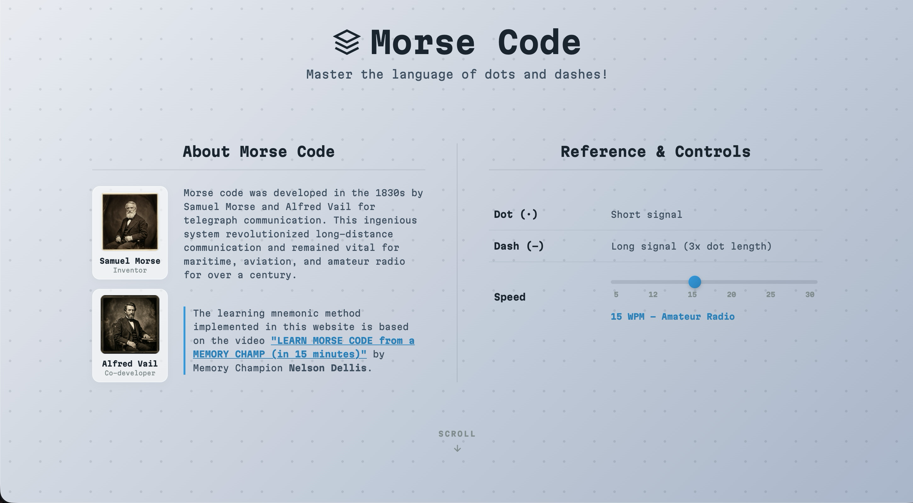
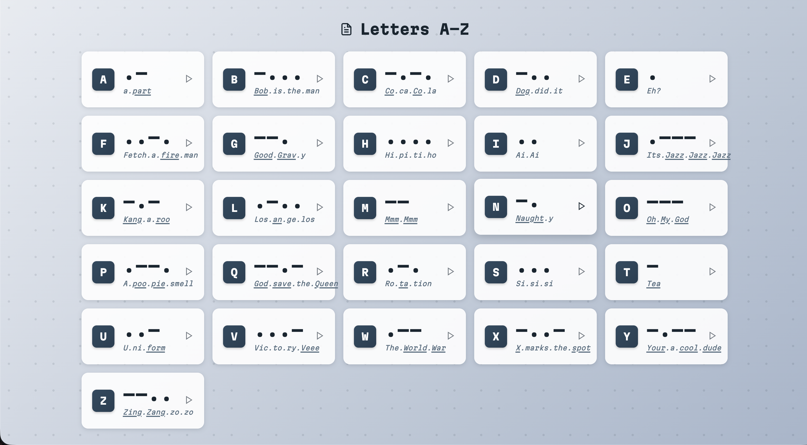
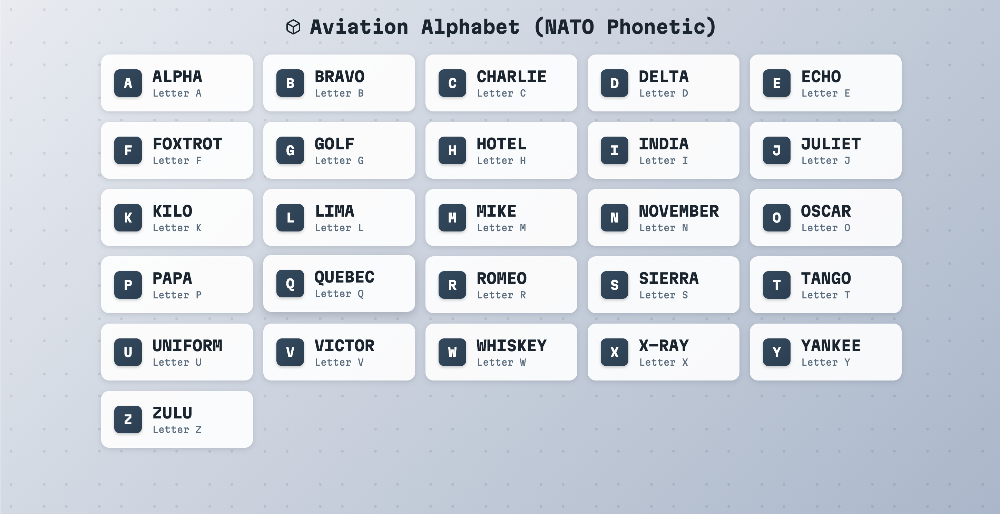

# Morse Code

A clean, responsive single-page web application designed to help people learn Morse code. It utilizes auditory feedback via Web Audio API synthesis, visual mnemonics based on Memory Champion Nelson Dellis's techniques, and a NATO phonetic reference sheet.

## ✨ Features

- **Interactive Morse Soundboard**: Click on any letter (A-Z) or number (0-9) card to listen to its audio signal.
- **Nelson Dellis Mnemonics**: Embedded visual word keys for every letter to speed up memorization.
- **Adjustable WPM Speed**: Custom range slider allowing speeds between 5 WPM and 30+ WPM.
- **NATO Aviation Chart**: Complete reference sheet containing phonetic spelling and Morse audio playbacks.
- **Symmetric Hero Layout**: Clean split columns featuring history cards and adjustable controls.
- **Zero Dependencies**: Pure vanilla code running entirely on client-side browser technology.

## 📸 Screenshots





## 🛠️ Tech Stack

   

## 📁 Project Structure

```
morse.code/
├── assets/
│   ├── alfred_vail.png
│   ├── samuel_morse.png
│   ├── logo.png
│   ├── dot.png
│   ├── SCRN_1.png
│   ├── SCRN_2.png
│   └── SCRN_3.png
├── index.html               # Main application
├── .gitignore
└── README.md
```

---

<p align="center">
  Made with ❤️ by <b>Alvin</b><br>
  ⭐ If you found this project useful, consider giving it a star.
</p>
